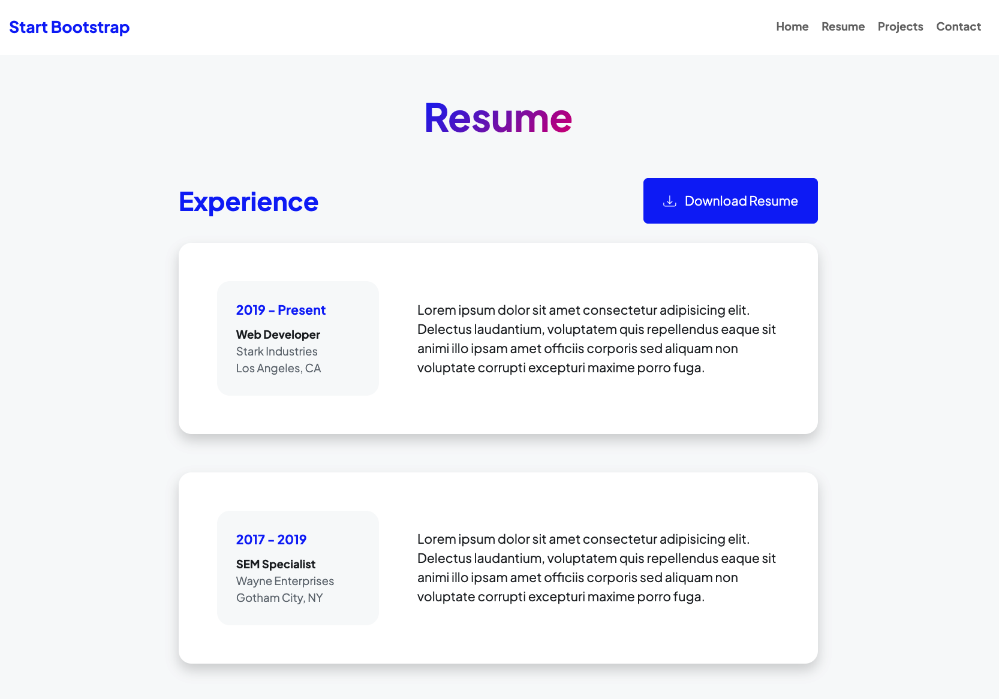
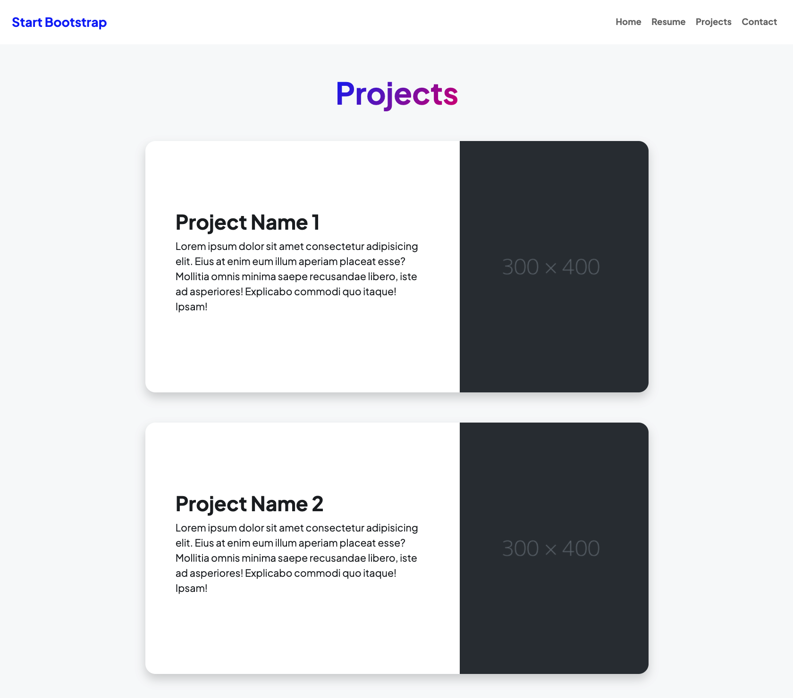
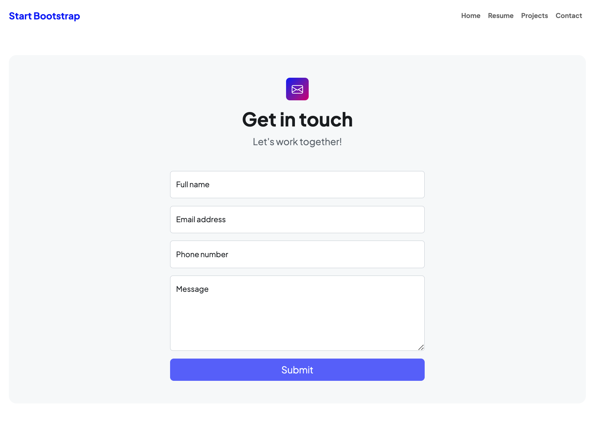

# Réalisation d'un portfolio avec Symfony

---

## Introduction

Votre mission du jour consiste à réaliser un portfolio avec Symfony. Vous allez devoir créer un projet Symfony (créer une base de données, créer des entités, créer des contrôleurs et créer des templates).

## Objectifs

À l'aide de vos connaissances sur le framework Symfony, vous allez devoir réaliser un portfolio avec les besoins suivants une :

### Page d'accueil

### Page de présentation

### Page des projets

### Page de contact

---
## L'interface

Le design complet vous est fournis dnas le dépôt GitHub. Vous pouvez le télécharger [ici](./template.zip).

Créer des contrôleurs et des templates twig avec des "partials" pour chaque page.

---
## Les projets

Mettez en place une base de données à l'aide de doctrine.

Vous allez devoir créer une entité `Project` avec les propriétés suivantes :

- `id` (int), pour rappel il sera automatiquement généré par doctrine
- `title` (string)
- `description` (string)
- `image` (string)

Procédez ensuite aux commande permettant migrations pour ajouter toutes les tables en base de données.

##### Les + pour les projets (facultatif)

Avec AppFixtures, ajoutez 10 projets en base de données.

---
### Espace d'administration (Pour aller plus loin)

Créez un espace d'administration pour gérer les projets. Pour cela vous allez utiliser le bundle [EasyAdminBundle](https://symfony.com/doc/current/bundles/EasyAdminBundle/index.html).

---
## Rappels importants

- Les lien doivent être fonctionnels et dynamiques dans les templates twig
- Les pages doivent être "découpées" en "partials" twig
- Modifier le fichier .env pour connecter votre base de données
- Réaliser un commit (10 minmum) à chaque importante de votre projet

## Rappel de étapes

| Étapes | À faire |
| :---: | :--- |
| 01 | L'environnement de développement |
| 02 | Installation de Symfony |
| 03 | Création d'un projet Symfony |
| 04 | Création du contrôleur : Accueil |
| 05 | Création du contrôleur : Presentation |
| 06 | Création du contrôleur : Projets |
| 07 | Création du contrôleur : Contact |
| 08 | Templates Twig |
| 09 | Doctrine ORM |
| 10 | Création de l'entité : Projets |
| 11 | Validation des données |
| 12 | AppFixtures, les données de tests |
| 13 | Installation de EasyAdmin |
| 14 | Configuration de EasyAdmin |
| 15 | CRUD de EasyAdmin |

---
## Ressources

- [Symfony](https://symfony.com/)
- [Twig](https://twig.symfony.com/)
- [Cheatsheet Bootstrap Officielle](https://getbootstrap.com/docs/5.0/examples/cheatsheet/)
- [Cheatsheet Bootstrap Secondaire](https://bootstrap-cheatsheet.themeselection.com/)
- [Google](https://www.google.com/) / [Stackoverflow](https://stackoverflow.com/) / [Bing](https://www.bing.com/)